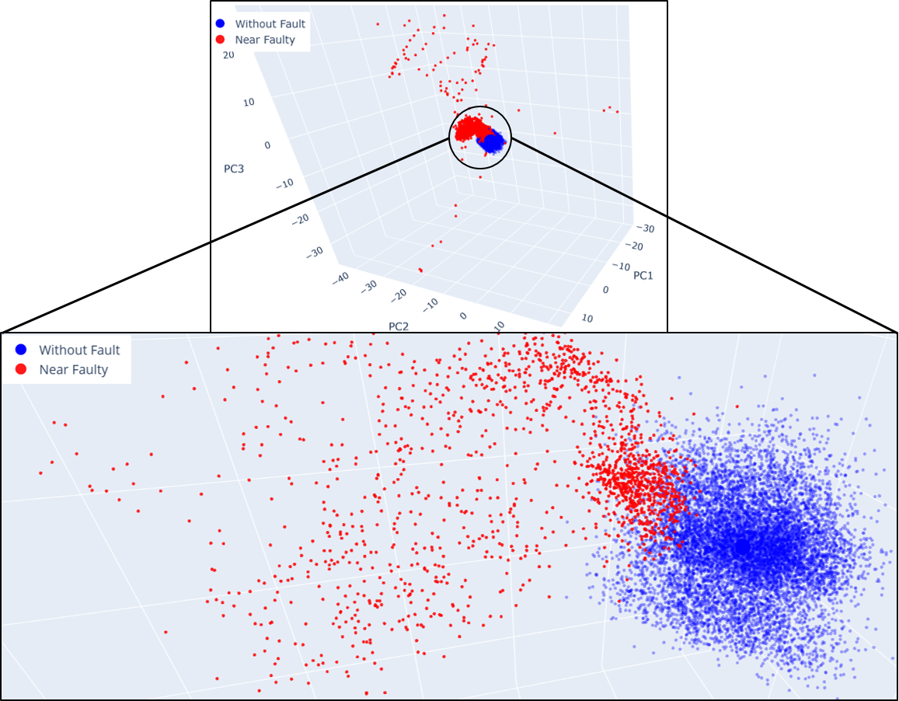
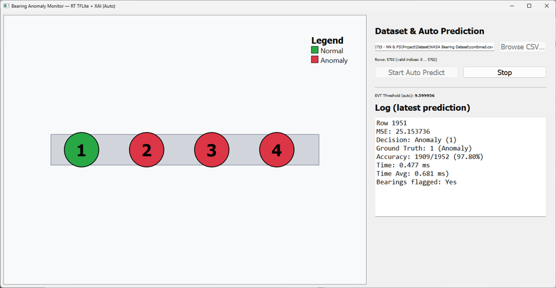

# ⚙️ Unsupervised Early Bearing Fault Detection (Lightweight VAE)

[](https://www.python.org/)  
[](https://www.tensorflow.org/)  
[](LICENSE)

---

## 📌 Overview
This repository contains the implementation of a **lightweight Variational Autoencoder (VAE)** designed for **unsupervised bearing fault detection** in rotating machinery.  
Unlike supervised approaches, the model **learns only from normal operating data**, enabling it to flag faults early—even those not seen during training.  

The pipeline combines:
- **Feature engineering** (time & frequency-domain vibration features).  
- **3D-PCA visualization** for dimensionality reduction & inspection.  
- **Lightweight VAE** for reconstruction-based anomaly detection.  
- **Thresholding** using Percentiles & Extreme Value Theory (EVT).  
- **Edge deployment** on devices like **Jetson Nano** (INT8 quantized).  
- A simple **GUI app** for real-time monitoring.

---

## 🖼️ Figures

### Fig. 1. Accelerometer mounting and sensor locations on the bearing housings


### Fig. 2. 3D PCA of vibration features


### Fig. 3. GUI Application for fault detection


<!-- *(Replace `images/...` paths with your actual GitHub image paths)* -->

---

## 🔧 Methodology

1. **Data Collection & Preprocessing**
   - Vibration signals from accelerometers mounted on bearing housings.
   - Features engineered from both **time domain** (RMS, kurtosis, skewness, etc.) and **frequency domain** (spectral energy, peak frequencies).

2. **Dimensionality Reduction (3D PCA)**
   - Features projected into 3D space for visualization and separability checks.

3. **Variational Autoencoder (VAE)**
   - Trained only on *normal* operating data.
   - Uses compact architecture for fast, low-power inference.

4. **Anomaly Scoring**
   - Reconstruction error (MSE) is used to score each sample.
   - Thresholds chosen by:
     - **Percentile cutoff** (simple, interpretable).
     - **Extreme Value Theory (EVT)** (robust to outliers).

5. **Deployment**
   - Model quantized to **INT8** and deployed on Jetson Nano.
   - Real-time inference at ~0.6–0.7 ms per data row.

---

## 📊 Key Results

- **AUROC:** 1.0  
- **AUPR:** 1.0  
- **Inference speed (Jetson Nano):** ~0.6–0.7 ms per row  
- **Memory footprint:** <10 MB after quantization  

These results demonstrate **perfect separability** between normal and faulty conditions, with edge-ready inference capabilities.

---

## 🚀 Installation

Clone the repository:
```bash
git clone https://github.com/md-jawad-117/Unsupervised_Early_Bearing_Fault_Detection.git
cd Unsupervised_Early_Bearing_Fault_Detection
